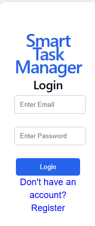

# Smart Task Manager

## Project Overview

Smart Task Manager is a Full Stack Web Application developed using React.js and Express.js. The application allows users to register and manage daily tasks through a simple user interface.

## Features

* Registration Module
* Task Creation
* Dynamic Task Rendering
* REST API Integration
* Responsive UI

## Technology Stack

### Frontend

* React.js
* Vite
* CSS

### Backend

* Node.js
* Express.js

## Screenshots

### Home Page

### Add Task Feature

## Learning Outcomes

* React Hooks
* API Development
* Frontend-Backend Communication
* Full Stack Development Basics

## Future Scope

* MongoDB Database
* JWT Authentication
* Task Update/Delete
* Cloud Deployment
